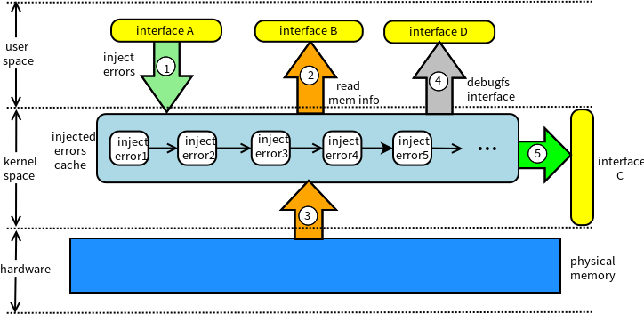

# MEI (Memory Error Injection)

*Wang Xiaoqiang<wang_xiaoq@126.com> Distributed & Embedded System Lab (DSLab)*

MEI is a memory errors injection tool to validate the memory testers. Memory testers implemented in userspace should use the interface 'read_byte_from_addr' provided in ./userlib/ directory. Kernel space memory testers can directly use the interface 'mei_read_byte' exported by the MEI kernel module.

Also we provide some userspace tools to inject memory errors and delete the injected memory errors. A debugfs interface - /sys/kernel/debug/MEI/inject_errors is provided to show and manipulate injected memory errors.

The MEI architecture is as follows:



## Usage
1. cd MEI #enter the directory of MEI.
2. make
3. make install
4. cd tools
5. make
6. sudo ./memerr-inject ./inject-file
7. sudo cat /sys/kernel/debug/MEI/inject_errors
8. sudo ./del-inject 6194567860 #delete the previously injected error, argument "6194567860" here is the first element in ./inject-file representing the physical address of memory error.
9. sudo cat /sys/kernel/debug/MEI/inject_errors

### memerr-inject
memerr-inject is a tool to inject memory errors. It reads the injected errors information from a file and parses it, and then injects the error into the kernel.

#### gen-single-inject-file.py and gen-multi-inject-file.py
Two scripts are provided to generate error inject file automatically. 'gen-single-inject-file.py' can be used to generate single-bit memory errors and 'gen-multi-inject-file.py' is for multi-bit memory errors. For example:

`./gen-single-inject-file.py 10`

Above command can generate 10 sing-bit memory errors in an inject file named 'single-inject-file.10' (yours can differ from mine):
```
3350121056 1  0 0 1 0 0 0 0 0  0 0 0 0 0 0 0 0
3516773813 1  0 1 0 0 0 0 0 0  0 1 0 0 0 0 0 0
6279310205 1  0 0 0 0 0 0 0 1  0 0 0 0 0 0 0 1
2632506354 1  0 1 0 0 0 0 0 0  0 0 0 0 0 0 0 0
3408170433 1  0 0 0 0 0 0 1 0  0 0 0 0 0 0 1 0
699552298 1  0 0 0 1 0 0 0 0  0 0 0 0 0 0 0 0
1128567382 1  0 0 0 1 0 0 0 0  0 0 0 0 0 0 0 0
2834442365 1  1 0 0 0 0 0 0 0  1 0 0 0 0 0 0 0
5442120705 1  0 0 1 0 0 0 0 0  0 0 1 0 0 0 0 0
4036826454 1  0 0 0 0 0 0 0 1  0 0 0 0 0 0 0 0
```

#### inject-file Format
We use the following structure to represent injected memory errors in kernel:
```
struct inject_memory_err {
        unsigned long phy_addr; /* where the error to inject in physical address */
        int err_bit_num; /* number of error bits in a byte */
        int bit[BYTESIZE]; /* which bit in the byte have error */
        int bit_value[BYTESIZE]; /* the bits stuck-at error values */
        struct list_head lists;
};
```
The member 'phy_addr' is the target physical memory address to inject errors. 'bit_num' stands for how many error bits in this byte. 'bit' and 'bit_value' stands for which bits have errors and the values of these bits.

We use a very simple format of inject-file. As you can see in the example inject-file, it only contains values of these members of the structure in order. For example:

```
                      bit
                       /
      err_bit_num      |
           /  ---------------
           |  |             |
6194567860 2  0 1 0 0 0 0 0 1  0 1 0 0 0 0 0 1
     |                         |             |
     \                         ---------------
  phy_addr                            \
                                 bit_value
```

### del-inject Usage
del-inject is used to delete some injected memory errors from the kernel. It takes a command line parameter standing for the physical address at which the injected error happens. If all of the injected errors don't happend in the address, del-inject will ignore it and simply return.

### debugfs Interface
After the kernel module installation, you can see a directory in debugfs(usually mounted on /sys/kernel/debug/) called 'MEI'. There is a file under 'MEI' dirctory called 'inject_errors'. You can see and manipulate all injected errors through this interface.

Read all injected errors' information from the interface:
```
cat inject_errors
```
Clear all injected errors:
```
echo "clear" > inject_errors
```

## LICENSE
This software is under the license of GPL v2.

## PUBLICATION
*Xiaoqiang Wang, Xuguo Wang, Fangfang Zhu, Qingguo Zhou, Rui Zhou, MEI: A Light Weight Memory Error Injection Tool for Validating Online Memory Testers,* International Symposium on Software and System Reliability (ISSSR) 2016. [pdf](mei.pdf), [ppt](mei-ppt.pdf)
